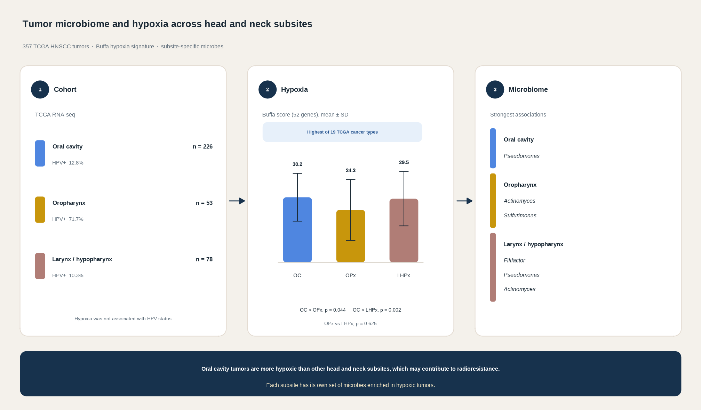

# exohnsc [](https://zenodo.org/badge/latestdoi/386135213)

Code for the analyses and figures in:

> Dhakal A, Upadhyay R, Wheeler C, Hoyd R, Karivedu V, Gamez ME, Valentin S, Vanputten M, Bhateja P, Bonomi M, Konieczkowski DJ, Baliga S, Mitchell DL, Grecula JC, Blakaj DM, Denko NC, Jhawar SR, Spakowicz D. **Association between Tumor Microbiome and Hypoxia across Anatomic Subsites of Head and Neck Cancers.** *International Journal of Molecular Sciences*. 2022;23(24):15531. doi: [10.3390/ijms232415531](https://doi.org/10.3390/ijms232415531). PMID: [36555172](https://pubmed.ncbi.nlm.nih.gov/36555172/).



## Regenerate the manuscript figures

Figure 1 and Figure 2A–C are drawn by the R Markdown files in `scripts/`. From the repository root, create the output directory and render all four. `rmarkdown::render()` knits each file with `scripts/` as the working directory, which is what the `../data` and `../figures` paths expect.

```r
install.packages(c(
  "rmarkdown", "tidyverse", "colorspace", "scales", "svglite",
  "ggdist", "RColorBrewer", "ggforce", "patchwork", "ggrepel"
))
```

```bash
mkdir -p figures
Rscript -e 'for (f in c(
  "scripts/fig1_buffa.Rmd",
  "scripts/fig2A_stackedBar.Rmd",
  "scripts/fig2B_volcano.Rmd",
  "scripts/fig2C_sigMicrobes.Rmd"
)) rmarkdown::render(f)'
```

Knitting the same files from RStudio with `exohnsc.Rproj` open is equivalent.

| Script | Manuscript figure | Output |
| --- | --- | --- |
| `scripts/fig1_buffa.Rmd` | Figure 1. Buffa hypoxia scores across TCGA cancer types, with HNSC split by subsite | `figures/fig1_buffa-cancer-raincloud.png`, `figures/fig1_buffa-cancer-raincloud.svg` |
| `scripts/fig2A_stackedBar.Rmd` | Figure 2A. Phylum-level relative abundance by tumor, faceted by subsite and ordered by Proteobacteria | `figures/fig1_stackedbar.png`, `figures/fig1_stackedbar.svg` |
| `scripts/fig2B_volcano.Rmd` | Figure 2B. Effect size versus unadjusted p-value for each subsite. Taxa with p < 0.01 and an absolute effect size above 0.5 are labeled | `figures/fig1_volcano_faceted.png` |
| `scripts/fig2C_sigMicrobes.Rmd` | Figure 2C. Effect sizes for the species named in the script, including *Pseudomonas*, *Actinomyces*, *Sulfurimonas*, *Filifactor alocis*, *Porphyromonas gingivalis*, and *Helicobacter pylori* | `figures/fig1_effectsize_selectmics.png` |

The `ggsave()` calls for Figure 2 still use a `fig1_` filename prefix.

### Data each script reads

Figure 1, Figure 2B, and Figure 2C use files that are already in `data/`:

- `data/buffa-mitophagy_tcga-cancer.RData` and `data/location.csv` for Figure 1. The R data file holds Buffa scores for TCGA cancer types. `location.csv` labels HNSC samples as oral cavity, oropharynx, or larynx/hypopharynx.
- `data/modelling_binom_OralCavity.csv`, `data/modelling_binom_Oropharynx.csv`, and `data/modelling_binom_LarynxHypopharinx.csv` for Figure 2B and Figure 2C. Each file is a table of binomial-model coefficients (`term`, `estimate`, `std.error`, `statistic`, `p.value`) for microbe relative abundance against a high-versus-low Buffa score.

Figure 2A also reads `data/hnsc_buffa.csv` and two cohort files that are not in this repository. The paths are hard-coded in `scripts/fig2A_stackedBar.Rmd`:

```
/fs/ess/PAS1695/projects/HNSC/data/drake-output/7-15-2021/7-15-2021_tcga_exora-with-taxonomy.csv
/fs/ess/PAS1695/projects/HNSC/data/drake-output/7-15-2021/7-15-2021_tcga_clinical.csv
```

Point those two `read.csv()` calls at local copies before rendering Figure 2A. The taxonomy table supplies exogenous-sequence relative abundances. The clinical table supplies `primary_site`, which the script maps to oral cavity, oropharynx, and larynx/hypopharynx.
